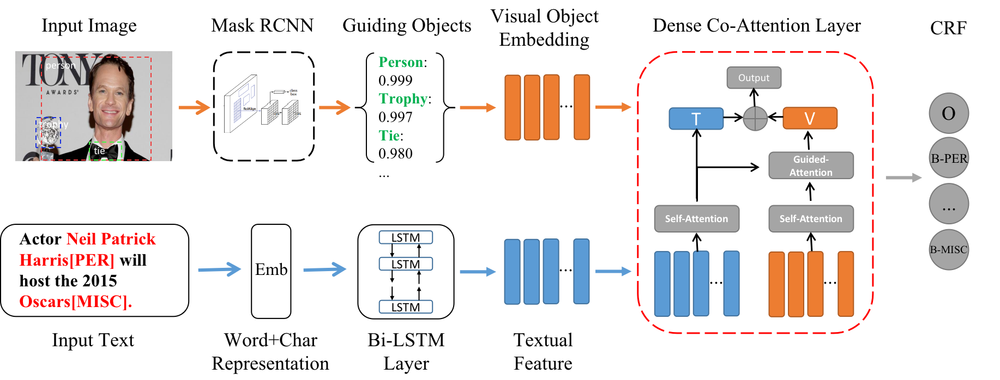

# Multimodal Representation with Embedded Visual Guiding Objects for Named Entity Recognition in Social Media Posts
Implementation of Our Paper ["Multimodal Representation with Embedded Visual Guiding Objects for Named Entity Recognition in Social Media Posts"](https://dl.acm.org/doi/10.1145/3394171.3413650) in MM'20. This implementation is based on the [NCRF++](https://github.com/jiesutd/NCRFpp).

## Model Architecture


The Overall Architecture of Our Model. Our Model Combines the Object-level Visual Features and Character-level
Word Representations to Predict Entities. A Dense Co-attention Module is Applied to Find Relevant Objects and Entities and Filter Out Irrelevant Visual Information.

## Requirements
1. Python 3.6 or higher
2. Pytorch 1.1.0


### Data Format
- You can download the multimodal dataset from [twitter2015](https://github.com/jefferyYu/UMT)
- We adopt the glove embeddings to initialize our model which can be downloaded [here](http://nlp.stanford.edu/data/glove.twitter.27B.zip)
- We preprocess the visual contents and extract the objects with [Mask-RCNN](https://github.com/matterport/Mask_RCNN/releases/download/v2.0/mask_rcnn_coco.h5 ). The preprocessed data will be available in data directory.


## Usage
Set the `status` attribute in sample.train.config to `train` or `decode` , and then
```
 python main.py --config demo.train.config
```

## Citation
If you find this repo helpful, please cite the following:
```
@inproceedings{wu2020multimodal,
  title={Multimodal Representation with Embedded Visual Guiding Objects for Named Entity Recognition in Social Media Posts},
  author={Wu, Zhiwei and Zheng, Changmeng and Cai, Yi and Chen, Junying and Leung, Ho-fung and Li, Qing},
  booktitle={Proceedings of the 28th ACM International Conference on Multimedia},
  pages={1038--1046},
  year={2020}
}
```